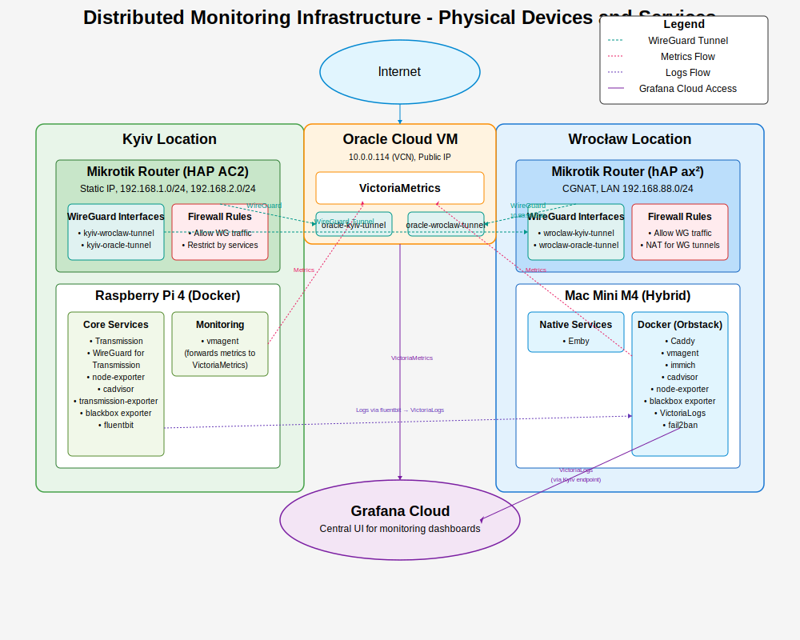

# Architecture

## Network Topology

### CGNAT Bypass Design

The core challenge: Wrocław (primary compute) is behind CGNAT and cannot receive direct inbound connections. Solution: Route all external traffic through Kyiv's static IP via WireGuard tunnels.

```
Internet → Cloudflare → Kyiv Router → WireGuard → Wrocław Services
```

### WireGuard Tunnels

| Tunnel | Network | Endpoints |
|--------|---------|-----------|
| Kyiv ↔ Wrocław | 10.77.88.0/30 | .1 (Kyiv) ↔ .2 (Wrocław) |

### Traffic Flow Example

```
1. User requests https://emby.domain.com
2. Cloudflare resolves to Kyiv public IP
3. Kyiv DSTNAT: public:443 → 192.168.88.2:443
4. Kyiv routing: 192.168.88.0/24 → tunnel 10.77.88.2
5. Wrocław receives via tunnel, Caddy proxies to Emby
6. Emby accesses media via NFS mount through tunnel
7. Response returns via tunnel with policy routing
```



## Development Patterns

### Directory Structure

```
docker-compose/
├── _base/                     # Base service definitions  
│   ├── authelia.yaml         # Authentication service
│   ├── caddy.yaml            # Reverse proxy
│   ├── emby.yaml             # Media server
│   ├── immich.yaml           # Photo management
│   ├── monitoring.yaml       # Monitoring stack
│   └── transmission.yaml     # BitTorrent client
├── wroclaw/                  # Mac Mini M4 location
│   ├── authelia.yaml         # Location override
│   ├── caddy.yaml
│   ├── immich.yaml
│   ├── monitoring.yaml
│   ├── .env.user             # User configuration
│   ├── .env.generated        # Auto-generated secrets
│   └── Makefile              # Location automation
└── kyiv/                     # Raspberry Pi location
    ├── monitoring.yaml       # Metrics collection
    ├── transmission.yaml     # Storage-local torrents
    ├── .env.user
    ├── .env.generated
    └── Makefile
```

### Docker Compose Override System

Services use Docker Compose override pattern:

```yaml
# _base/monitoring.yaml - Base service definition
services:
  grafana:
    image: grafana/grafana:latest
    environment:
      - GF_SECURITY_ADMIN_PASSWORD={{GRAFANA_ADMIN_PASSWORD}}

# wroclaw/monitoring.yaml - Location override
services:
  grafana:
    ports:
      - "3000:3000"  # Expose on Wrocław for external access
```

Template processing: `*.tmpl` files → `scripts/deploy` → environment-specific configs

### Service Deployment Patterns

**Template-based Services** (caddy, monitoring, authelia):
- Use `*.tmpl` files with variable substitution
- Full Makefile automation for setup/restart
- Multi-location support via overrides
- Auto-regeneration on configuration changes

**Direct Services** (emby, immich):
- Direct Docker Compose definitions
- Environment variable configuration only
- Location-specific deployment

### Deployment Workflow

```bash
# Initial setup (from docker-compose/wroclaw/)
cp .env.user.example .env.user     # Configure credentials  
make all-setup                     # Generate secrets and configs
make all-up                        # Start all services

# Service-specific workflow
make select SERVICE=monitoring     # Select service to work on
make setup                         # Setup selected service
make up                           # Start selected service
make logs                         # View logs

# Configuration changes
vim ../monitoring/config.alloy.tmpl  # Edit template
make restart                          # Auto-regenerates and restarts
```

## Monitoring Architecture

### Metrics Collection

Each location runs Grafana Alloy (formerly vmagent) collecting:
- System metrics (node_exporter)
- Container metrics (cAdvisor)
- Router metrics (mikrotik_exporter)
- Service metrics (custom exporters)

Data flows to central VictoriaMetrics on Wrocław Mac Mini.

### Log Aggregation

VictoriaLogs replaced Loki for better performance:
- Alloy collects logs from all containers
- Forwarded to central VictoriaLogs on Wrocław Mac Mini
- Accessed via Grafana dashboards

### Alert Hierarchy

1. **Location Down** - Highest priority (>5min offline)
2. **Component Down** - Network/host issues
3. **Service Down** - Application problems

## Security Model

### Network Security
- WireGuard encryption for all inter-site traffic
- Minimal port exposure (only Kyiv has public ports)
- Cloudflare DDoS protection and WAF
- Policy-based routing prevents leaks

### Application Security
- Authelia provides SSO with 2FA
- Caddy handles TLS termination
- Service isolation via Docker networks
- Secrets managed via .env files (never committed)

## Storage Architecture

### Kyiv NFS Server
- 8TB RAID array exported via NFS
- Accessible only through WireGuard tunnel
- Mounted by Wrocław services needing media

### Local Storage
- Wrocław: 2TB SSD for containers and databases
- Kyiv: 8TB HDD for media storage and torrents

## Resource Optimization

### Service Placement Logic
- **CPU-intensive** → Wrocław Mac Mini (Emby transcoding, VictoriaMetrics)
- **Storage-heavy** → Kyiv direct access (Transmission downloads)
- **Always-on** → Both locations (monitoring agents, essential services)
- **Central monitoring** → Wrocław Mac Mini (Grafana, VictoriaLogs)

### Bandwidth Management
- Compressed metrics reduce tunnel traffic
- Local caching minimizes repeated transfers
- Efficient log streaming via Alloy compression