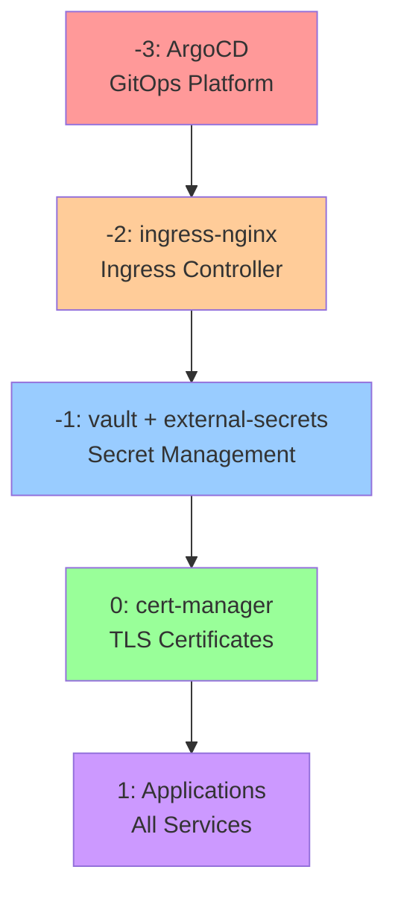

# Kubernetes Infrastructure

GitOps-managed Kubernetes infrastructure using ArgoCD with App-of-Apps pattern and sync wave dependency ordering.

## 📁 Directory Structure

```
kubernetes/
├── app-of-apps/                    # App-of-Apps pattern for ArgoCD
│   ├── Chart.yaml                  # Helm chart metadata
│   ├── templates/
│   │   ├── _application.tpl        # ArgoCD Application template helper
│   │   ├── applications.yaml       # Dynamic Application generation
│   │   └── projects.yaml           # ArgoCD Project definitions
│   ├── values.yaml                 # Global defaults and documentation
│   └── values/
│       └── homelab.yaml           # Homelab-specific app definitions
├── infrastructure/                 # Core cluster infrastructure
│   ├── charts/                    # Infrastructure Helm charts
│   │   ├── cert-manager/          # Certificate management (Let's Encrypt + Cloudflare)
│   │   └── ingress-nginx/        # Ingress controller with LoadBalancer
│   └── values/
│       └── homelab/              # Environment-specific values
│           ├── cert-manager.yaml
│           └── ingress-nginx.yaml
├── platform/                      # Platform services and DevOps tools
│   ├── charts/                    # Platform service Helm charts
│   │   ├── argocd/               # GitOps continuous deployment
│   │   ├── external-secrets/     # Vault integration for secret management
│   │   ├── vault/                # HashiCorp Vault for secrets
│   │   └── victoria-metrics-single/ # Metrics storage and collection
│   └── values/
│       └── homelab/              # Environment-specific values
│           ├── argocd.yaml
│           ├── external-secrets.yaml
│           ├── vault.yaml
│           └── victoriametrics.yaml
├── applications/                   # End-user applications
│   ├── charts/                    # Application Helm charts
│   │   └── external-services/    # Hybrid Docker→K8s service proxying
│   └── values/
│       └── homelab/              # Environment-specific values
│           └── external-services.yaml
└── README.md                      # This file
```

## 🔄 Sync Wave Dependencies

The infrastructure uses ArgoCD sync waves to ensure proper dependency ordering during deployment:



### Wave Descriptions

| Wave | Services | Purpose | Dependencies |
|------|----------|---------|--------------|
| **-3** | ArgoCD | Establishes GitOps platform | None (bootstrap) |
| **-2** | ingress-nginx | External traffic routing | ArgoCD for management |
| **-1** | vault, external-secrets | Secret management foundation | Ingress for Vault UI |
| **0** | cert-manager | TLS certificate automation | Vault for ACME secrets |
| **1** | All applications | End-user services | Cert-manager for TLS |

## 🚀 Getting Started

### Prerequisites

- OrbStack with Kubernetes enabled
- kubectl configured for homelab cluster
- Helm 3.x installed
- ArgoCD CLI (optional)

### Initial Deployment

1. **Deploy App-of-Apps** (one-time bootstrap):
   ```bash
   # Install ArgoCD first (manual bootstrap)
   kubectl create namespace argocd
   helm install argocd kubernetes/platform/charts/argocd \
     -n argocd \
     -f kubernetes/platform/values/homelab/argocd.yaml

   # Deploy App-of-Apps for GitOps management
   helm install app-of-apps kubernetes/app-of-apps \
     -n argocd \
     -f kubernetes/app-of-apps/values/homelab.yaml
   ```

2. **Access ArgoCD UI**:
   ```bash
   # Get LoadBalancer IP
   kubectl get svc argocd-server -n argocd
   
   # Access UI at https://<LOADBALANCER-IP>
   # Login: admin / (get password from secret)
   kubectl get secret argocd-initial-admin-secret -n argocd -o jsonpath="{.data.password}" | base64 -d
   ```

3. **Watch Sync Waves Deploy**:
   ArgoCD will automatically deploy services in wave order. Monitor progress:
   ```bash
   # Watch all applications
   kubectl get applications -n argocd
   
   # Follow logs
   kubectl logs -n argocd deployment/argocd-application-controller
   ```

## ⚙️ Configuration Management

### App-of-Apps Pattern

The `app-of-apps/` directory contains a Helm chart that generates ArgoCD Applications dynamically:

- **Global defaults** in `values.yaml`
- **Environment-specific** configurations in `values/homelab.yaml`
- **Project-based organization** (infrastructure → platform → applications)

### Adding New Applications

1. **Add to homelab.yaml**:
   ```yaml
   platform:
     applications:
       - name: my-new-service
         enabled: true
         path: kubernetes/platform/charts/my-new-service
         namespace: my-namespace
         annotations:
           argocd.argoproj.io/sync-wave: "1"  # Set appropriate wave
         helm:
           valueFiles:
             - ../../values/homelab/my-new-service.yaml
   ```

2. **Create Helm chart**:
   ```bash
   mkdir -p kubernetes/platform/charts/my-new-service
   helm create kubernetes/platform/charts/my-new-service
   ```

3. **Add values file**:
   ```bash
   touch kubernetes/platform/values/homelab/my-new-service.yaml
   ```

4. **Commit and push** - ArgoCD will automatically deploy!

### Environment Support

The structure supports multiple environments:

```
values/
├── homelab/          # Production homelab
├── staging/          # Staging environment (future)
└── dev/             # Development environment (future)
```

## 🔐 Secret Management

### Vault Integration

Secrets are managed through HashiCorp Vault with external-secrets-operator:

1. **Vault stores secrets**: `kv/service/secret-name`
2. **External-secrets fetches**: Creates Kubernetes Secrets
3. **Applications consume**: Standard Kubernetes Secret mounts

### Secret Workflow

```bash
# Store secret in Vault
vault kv put kv/myapp/database password="secret123"

# Create ExternalSecret
apiVersion: external-secrets.io/v1
kind: ExternalSecret
metadata:
  name: myapp-database
spec:
  secretStoreRef:
    name: vault-backend
    kind: ClusterSecretStore
  target:
    name: myapp-database-secret
  data:
    - secretKey: password
      remoteRef:
        key: kv/myapp/database
        property: password
```

## 🔧 Sync Policies

### Global Defaults

```yaml
syncPolicy:
  automated:
    prune: true      # Remove orphaned resources
    selfHeal: true   # Correct configuration drift
  syncOptions:
    - "CreateNamespace=true"    # Auto-create namespaces
    - "ServerSideApply=true"    # Use server-side apply
    - "PruneLast=true"         # Delete resources last
  retry:
    limit: 3                   # Retry failed syncs
    backoff:
      duration: "5s"
      factor: 2
      maxDuration: "2m"
```

### Safety Overrides

Critical services override sync policies for safety:

- **ArgoCD**: `prune: false` (never auto-delete ArgoCD itself)
- **Infrastructure**: `prune: false` (never auto-delete CNI/ingress)

### Traffic Flow

```
Internet → Cloudflare → Kyiv Router → WireGuard → OrbStack LoadBalancer → ingress-nginx → Services
```

Automated via cert-manager + Let's Encrypt + Cloudflare DNS-01:

1. **cert-manager** detects Ingress with TLS
2. **Cloudflare DNS-01** challenge via external-secrets
3. **Let's Encrypt** issues certificate
4. **Certificate** auto-renewed every 60 days

## 📚 Additional Resources

- [ArgoCD Documentation](https://argo-cd.readthedocs.io/)
- [Helm Documentation](https://helm.sh/docs/)
- [cert-manager Documentation](https://cert-manager.io/docs/)
- [HashiCorp Vault Documentation](https://www.vaultproject.io/docs)
- [External Secrets Operator](https://external-secrets.io/)

## 🔄 Migration Guide

### Hybrid Kubernetes/Docker Compose

The infrastructure supports hybrid deployments:

1. **Keep Docker services running** on Wrocław/Kyiv
2. **Add external-services** chart to proxy Docker → Kubernetes

See `applications/charts/external-services/` for hybrid architecture patterns.
